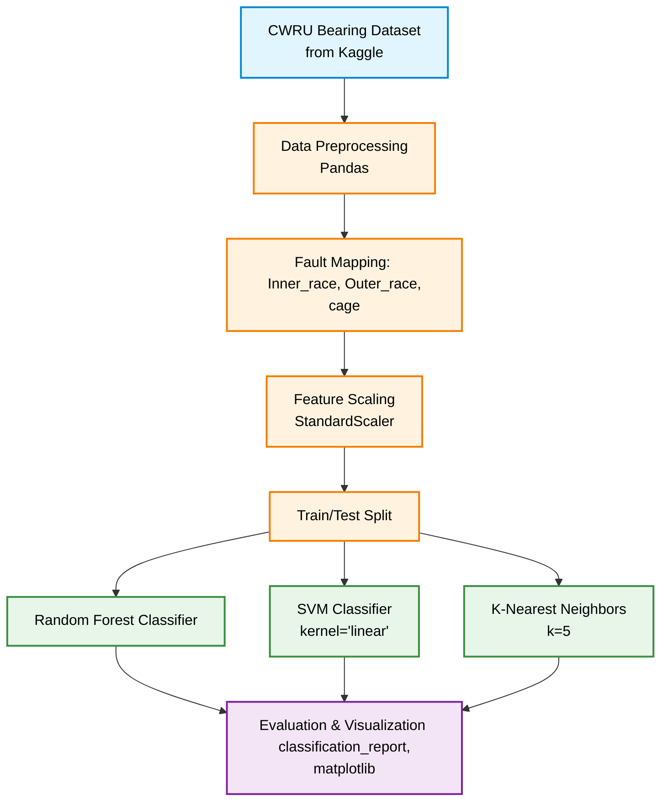

# ⚙️ Bearing Fault Analysis

A machine learning project designed to detect and classify bearing faults in rotating machinery using the widely recognized CWRU (Case Western Reserve University) Bearing Dataset. By analyzing time-domain features, this system categorizes faults into specific physical bearing locations using various classification algorithms.

## ✨ Features

* **Automated Data Retrieval**: Directly downloads the CWRU dataset from Kaggle using `opendatasets`.
* **Feature Processing**: Maps complex sub-fault categories (e.g., `Ball_007_1`, `OR_021_6_1`) into clear, primary physical fault locations: `cage`, `Inner_race`, and `Outer_race`.
* **Multi-Model Training**: Trains and compares three powerful classification models: 
  * Random Forest Classifier
  * Support Vector Machine (SVM)
  * K-Nearest Neighbors (KNN)
* **Performance Visualization**: Generates scatter plots (e.g., RMS vs. Skewness) to visually evaluate correct vs. incorrect classifications across the physical fault types.

## 🏗️ Architecture

The analytical pipeline follows a structured data science workflow:
1. **Ingestion & Preprocessing**: Data is loaded, null-checked, and targeted fault labels are simplified via mapping.
2. **Standardization**: Features (like mean, std, rms, skewness, kurtosis, crest, form) are standardized using Scikit-Learn's `StandardScaler` to ensure optimal model performance.
3. **Training & Evaluation**: The standardized data is split and fed into the three parallel ML models. Evaluation is conducted using classification reports and visual plotting.

### Architecture Flow



## 🛠️ Tech Stack

* **Environment**: Jupyter Notebook
* **Data Manipulation**: Pandas, NumPy
* **Machine Learning**: Scikit-learn (RandomForest, SVC, KNeighborsClassifier)
* **Data Visualization**: Matplotlib
* **Dataset Management**: opendatasets (Kaggle API)

## 🚀 Getting Started

### Prerequisites

* Python 3.8+
* A Kaggle API Key (`kaggle.json`) to download the dataset seamlessly.

### Installation

1. **Clone the repository:**
   ```bash
   git clone [https://github.com/your-username/bearing_fault_analysis.git](https://github.com/your-username/bearing_fault_analysis.git)
   cd bearing_fault_analysis
   ```

2. **Install the dependencies:**
   ```bash
   pip install pandas numpy scikit-learn matplotlib opendatasets
   ```

### Running the Analysis

Open the Jupyter Notebook to run the cells sequentially:

```bash
jupyter notebook Bearing_Faults.ipynb
```

**Note on Dataset Download:**
When you run the notebook, the `opendatasets` library will prompt you for your Kaggle username and Kaggle API key to download the `cwru-bearing-datasets`.

## 📊 Results

The models yield extremely high precision and recall (upwards of 98% accuracy for Random Forest) on the testing data. The notebook outputs a final `random_forest_classification_results.png` which maps successful versus failed predictions against the `RMS` and `Skewness` dimensions.

## 🤝 Contributing
Contributions, issues, and feature requests are welcome!
Feel free to check the issues page.
